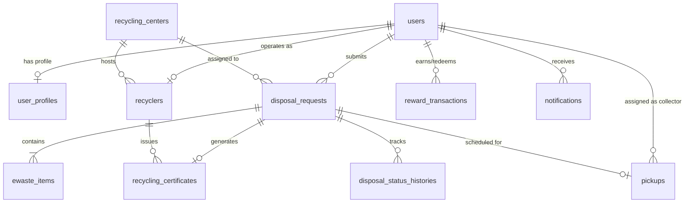

# Smart E-Waste Collection & Recycling Management System

A production-ready, full-stack enterprise application engineered to solve urban electronic waste challenges through smart disposal recommendations, location-based recycling center discovery, doorstep pickup scheduling, public QR lifecycle tracking, institutional bulk disposal, gamified green points rewards, digital recycling certificates, environmental impact analytics, and India-focused e-waste compliance support.

---

## 📌 Overview

The **Smart E-Waste Collection & Recycling Management System** connects individual citizens, commercial institutions, logistics collectors, registered recycling facilities, and system administrators on a single unified platform. By digitizing the end-to-end lifecycle of discarded electronics, the system prevents informal dumping, incentivizes safe recycling, and promotes environmental sustainability.

---

## ⚠️ Problem Statement

Electronic waste (e-waste) is one of the fastest-growing waste streams globally and in India. Key challenges include:
- **Lack of Awareness**: Citizens and organizations often do not know whether a device should be repaired, refurbished, reused, or recycled.
- **Informal Disposal Risks**: Dumping e-waste in informal sectors leads to hazardous chemical exposure (lead, mercury, cadmium) and toxic open-air burning.
- **Logistical Friction**: Lack of scheduled doorstep collection options deters citizens from sending items to authorized recyclers.
- **Institutional Friction**: Schools, colleges, and corporate offices struggle to process bulk disposals transparently.
- **Lack of Traceability & Trust**: Disposers cannot verify if their electronics were safely recycled according to regulatory frameworks (e.g., CPCB E-Waste Rules 2022).

---

## 💡 Proposed Solution

Our solution provides a comprehensive digital platform featuring:
1. **Smart Recommendation Engine**: Evaluates item category, condition, working status, and age to recommend optimal eco-friendly actions (Repair, Reuse, Donate, Refurbish, or Recycle).
2. **Doorstep Pickup & Collector Dispatch**: Enables citizens and institutions to schedule convenient pickup times with assigned logistics personnel.
3. **Public QR Lifecycle Tracking**: Generates unique tracking numbers and QR codes for real-time visibility from collection to final recycling.
4. **Institutional Bulk Disposal**: Supports bulk item submission and CSV bulk uploads for colleges, corporate offices, and institutions.
5. **Gamified Eco-Credits (Green Points)**: Rewards disposers with green points and eco-tiers (Seedling, Eco Warrior, Green Champion, Planet Savior).
6. **Verifiable Digital Certificates**: Issues tamper-evident recycling certificates with QR codes for institutional compliance and ESG reporting.
7. **India-Focused E-Waste Compliance Support**: Provides educational guidelines, EPR (Extended Producer Responsibility) insights, and registered recycler verification references.

---

## ✨ Key Features

- **Smart Disposal Recommendations**: Automated decision engine analyzing device age, condition, and category.
- **Location-Based Recycling Center Discovery**: Interactive search and filtering for registered recycling facilities by city and postal code.
- **Doorstep Pickup Scheduling**: Convenient date and time-slot selection for individual and bulk collections.
- **QR Lifecycle Tracking**: Transparent status progression (`SUBMITTED` → `APPROVED` → `SCHEDULED` → `ON_THE_WAY` → `COLLECTED` → `IN_TRANSIT` → `PROCESSING` → `COMPLETED`).
- **Green Points & Rewards**: Automated point crediting upon recycling completion with tier progression.
- **Digital Recycling Certificates**: Downloadable digital certificates with unique hash verification codes for compliance.
- **Environmental Analytics**: Real-time metrics calculating total e-waste recycled, CO2 emissions offset, toxic materials diverted, and metals recovered.
- **Institutional Bulk Disposal**: Support for institutional disclaimers, GST numbers, contact persons, and multi-category CSV bulk uploads with preview validation.
- **India-Focused Compliance Support**: Informational modules explaining CPCB E-Waste Management Rules 2022, EPR concepts, safe battery handling, and registered recycler importance.

---

## 👥 User Roles

1. **Individual Citizen (`USER`)**: Submit e-waste items, view smart recommendations, schedule pickups, track request status via QR, earn green points, and download recycling certificates.
2. **Institutional Disposer (`USER` with `INSTITUTION` type)**: Perform bulk e-waste disposals, upload multi-item CSV files, manage institutional profile data, and access downloadable compliance reports.
3. **Collector / Logistics Partner (`COLLECTOR`)**: View assigned pickup tasks, navigate to pickup locations, update real-time collection statuses (`ON_THE_WAY`, `COLLECTED`), and add field notes.
4. **Recycler Facility Manager (`RECYCLER`)**: Receive collected e-waste shipments, log weight and processing details, complete recycling, and trigger automated reward crediting and certificate generation.
5. **System Administrator (`ADMIN`)**: Access full system metrics, manage users/collectors/recyclers/centers, approve/reject disposal requests, assign collectors, inspect audit logs, and maintain compliance records.

---

## 🏗 Architecture

The system follows a modern decoupled client-server architecture:

```
┌─────────────────────────────────────────────────────────┐
│                    React SPA Frontend                   │
│           (React 18, React Router, Vite, Bootstrap)     │
└────────────────────────────┬────────────────────────────┘
                             │ REST API (HTTPS / JSON / JWT)
┌────────────────────────────▼────────────────────────────┐
│                  Spring Boot Backend REST API           │
│       (Java 17/21/25, Spring Security, JPA/Hibernate)  │
└────────────────────────────┬────────────────────────────┘
                             │ SQL Queries (Flyway Migrations)
┌────────────────────────────▼────────────────────────────┐
│                    PostgreSQL Database                  │
│               (Persistent Relational Storage)            │
└─────────────────────────────────────────────────────────┘
```

---

## 🛠 Technology Stack

- **Frontend**: React 18, Vite 6, React Router DOM 6, Axios, Bootstrap 5, Bootstrap Icons
- **Backend**: Java 17+, Spring Boot 3.4, Spring Security, Spring Data JPA, Hibernate, Flyway DB Migration, JJWT
- **Database**: PostgreSQL (Production/Docker), H2 (In-Memory Testing)
- **Containerization**: Docker, Docker Compose, Nginx (Reverse Proxy)
- **Build Tools**: Maven (`mvnw`), Node.js / NPM

---

## 🗄️ Database Design

The relational database is configured with versioned SQL migrations (`V1__init_schema.sql` to `V11`):



### Core Entities:
- **`users`**: System login accounts (Email, Password Hash, Role, Active State).
- **`user_profiles`**: Individual and institutional details (Name, Phone, Address, Organization, GST).
- **`disposal_requests`**: Master disposal record (Tracking Number, Status, Recommended Action, Verification Code).
- **`ewaste_items`**: Line items within a disposal request (Category, Brand, Quantity, Age, Condition).
- **`pickups`**: Doorstep logistics record (Scheduled Date, Time Slot, Collector ID, Status).
- **`disposal_status_histories`**: Audit trail recording every status change timestamp and actor.
- **`recyclers` & `recycling_centers`**: Registered recycling facility profiles and capacities.
- **`recycling_certificates`**: Digital verifiable recycling certificates (Certificate Number, Recycled Weight).
- **`reward_transactions`**: Ledger for green points earned and redeemed.
- **`notifications`**: In-app notifications triggered during lifecycle events.

---

## 🔄 Application Workflow

```
[ Citizen / Institution ] ──► Submit Disposal Request (Single / CSV Bulk)
                                       │
                                       ▼
                       [ Smart Recommendation Engine ]
                                       │
                                       ▼
[ Citizen / Institution ] ──► Schedule Doorstep Pickup
                                       │
                                       ▼
       [ Admin ] ──────────► Approve Request & Assign Collector
                                       │
                                       ▼
     [ Collector ] ────────► Update Status to ON_THE_WAY -> COLLECTED
                                       │
                                       ▼
      [ Recycler ] ────────► Receive Shipment & Mark PROCESSING -> COMPLETED
                                       │
                                       ├──────────► Green Points Credited
                                       └──────────► Digital Certificate Issued
```

---

## 🖼️ Screenshots

| Section | Preview Placeholder |
| :--- | :--- |
| **Landing Page** | *[ Landing Hero, How It Works, Environmental Impact Stats ]* |
| **User Dashboard** | *[ Request Overview, Active Pickups, Eco-Tier Badge & Green Points ]* |
| **Bulk E-Waste Disposal** | *[ Multi-Category Form, CSV Bulk Upload & Validation Preview ]* |
| **Collector Portal** | *[ Assigned Pickups List, Route Details & Status Update Modal ]* |
| **Recycler Hub** | *[ Incoming Shipments, Weight Entry & Recycling Completion ]* |
| **Admin Control Panel** | *[ Analytics Cards, User/Collector Management, Request Approval ]* |
| **Public QR Tracking** | *[ Live Visual Progress Bar, Timeline History & Recommendation ]* |
| **Recycling Certificate** | *[ Verifiable Digital Certificate with Verification QR Code ]* |

---

## 📦 Installation

### Prerequisites
- **Git**: Installed and configured.
- **Docker & Docker Compose**: Installed for containerized deployment (Recommended).
- **Java JDK 17+** and **Node.js 18+**: Required only for manual local setup.

### Clone Repository
```bash
git clone https://github.com/KavidharshanKD/E-Waste-Management.git
cd "E-Waste Management System"
```

---

## 🔐 Environment Variables

Create `.env` file from `.env.example`:

```bash
# Copy example configuration template
cp .env.example .env
```

### Reference Variables (`.env`)
| Variable | Description | Default Value |
| :--- | :--- | :--- |
| `POSTGRES_DB` | PostgreSQL Database Name | `ewastedb` |
| `POSTGRES_USER` | PostgreSQL Database User | `ewaste_user` |
| `POSTGRES_PASSWORD` | PostgreSQL Database Password | `ewaste_password_change_in_production` |
| `POSTGRES_PORT` | PostgreSQL Host Port | `5432` |
| `SPRING_PROFILES_ACTIVE` | Spring Boot Active Profile | `prod` |
| `BACKEND_PORT` | Backend API Server Host Port | `8080` |
| `FRONTEND_PORT` | Frontend React Web App Host Port | `5173` |
| `JWT_SECRET` | JWT Token Base64 Signing Key | `dGhpcyBpcyBhIHZhbGlkIGJhc2U2NCBzZWNyZXQga2V5IDEyMzQ1Njc4OTA=` |

---

## 🏃 Running Locally (Development Mode)

### Backend Setup (Spring Boot)
```bash
cd backend

# Run tests
./mvnw test          # On Linux/macOS
mvnw.cmd test        # On Windows

# Start Spring Boot application
./mvnw spring-boot:run     # On Linux/macOS
mvnw.cmd spring-boot:run   # On Windows
```
The backend API will be available at [http://localhost:8080](http://localhost:8080).

### Frontend Setup (React SPA)
```bash
cd frontend

# Install dependencies
npm install

# Start Vite development server
npm run dev

# Build production assets
npm run build
```
The frontend SPA will be available at [http://localhost:5173](http://localhost:5173).

---

## 🐳 Running with Docker (Recommended)

Run the full production stack (PostgreSQL + Spring Boot + React SPA) with a single command:

```bash
docker compose up --build
```

### Access Services:
- **Frontend SPA**: [http://localhost:5173](http://localhost:5173)
- **Backend API**: [http://localhost:8080](http://localhost:8080)
- **API Health Check**: [http://localhost:8080/api/v1/health](http://localhost:8080/api/v1/health)

To stop containers:
```bash
docker compose down
```

---

## 🌐 API Overview

| Method | Endpoint | Description | Auth Required |
| :--- | :--- | :--- | :--- |
| `POST` | `/api/auth/register` | User/Institution Registration | Public |
| `POST` | `/api/auth/login` | User Authentication (Returns JWT Token) | Public |
| `GET` | `/api/public/track/{trackingNumber}` | Public E-Waste Tracking & Recommendation | Public |
| `GET` | `/api/public/verify-certificate/{certNumber}` | Public Recycling Certificate Verification | Public |
| `POST` | `/api/user/ewaste` | Submit E-Waste Request | `USER` |
| `POST` | `/api/user/pickups` | Schedule Doorstep Pickup | `USER` |
| `GET` | `/api/notifications` | In-App Lifecycle Notifications | Authenticated |
| `GET` | `/api/collector/pickups` | View Assigned Pickups | `COLLECTOR` |
| `PUT` | `/api/collector/pickups/{id}/status` | Update Collection Status | `COLLECTOR` |
| `PUT` | `/api/recycler/process/{id}` | Receive & Process Shipment | `RECYCLER` |
| `PUT` | `/api/recycler/complete/{id}` | Complete Recycling & Issue Certificate | `RECYCLER` |
| `GET` | `/api/admin/dashboard` | Admin Master Dashboard Metrics | `ADMIN` |
| `PUT` | `/api/admin/requests/{id}/approve` | Approve/Reject Request | `ADMIN` |
| `PUT` | `/api/admin/pickups/{id}/assign` | Assign Collector to Pickup | `ADMIN` |

---

## 🔒 Security Implementation

- **Password Hashing**: BCrypt strong password hashing for all user accounts.
- **Stateless Authentication**: JWT bearer tokens signed using HMAC SHA-256 keys.
- **Role-Based Access Control (RBAC)**: Backend endpoint protection restricting routes to specific roles (`ADMIN`, `COLLECTOR`, `RECYCLER`, `USER`).
- **Data Isolation**: Strict user-level authorization preventing unauthorized access to other users' requests or pickup records.
- **Secrets Management**: Zero plain-text credentials logged or exposed; externalized environment configurations via `.env`.
- **CORS & Input Sanitization**: Secure headers and sanitized inputs protecting against XSS and SQL injection.

---

## 🚀 Future Enhancements

- **Image-Based Device Recognition**: AI computer vision model to automatically detect device category and estimate working condition from uploaded photos.
- **Mobile Application**: Native iOS & Android application built with React Native for collectors and citizens.
- **Route Optimization**: Automated route planning and GPS navigation integration for pickup collectors.
- **Verified Recycler Integration**: Direct API integration with CPCB/State Pollution Control Board databases for live accreditation checks.
- **Automated Email & SMS Notifications**: Integration with Twilio / AWS SES for instant SMS and email notifications.
- **AI Recommendation Engine**: Advanced machine learning model to estimate component repairability and resale market value.

---

## ⚠️ Disclaimer

- Registration information should be independently verified with the relevant authority.
- This application is an independent educational/portfolio demonstration and does not claim direct integration with CPCB or any government system unless an explicit API integration exists.

---

## 🧑‍💻 Author

**Kavidharshan**
- GitHub: [@KavidharshanKD](https://github.com/KavidharshanKD)
