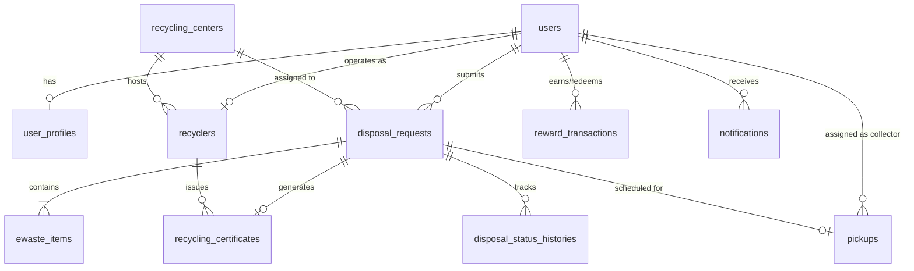

# Smart E-Waste Collection & Recycling Management System

A full-stack solution for managing e-waste collection, pickup scheduling, automated recycling workflow tracking, and eco-credit rewards.

---

## 🏗 Architecture Overview

```
E-Waste-Management/
├── backend/                # Spring Boot REST API (Java 17+, Maven, JPA, Security, PostgreSQL, Flyway)
│   ├── src/main/java/com/ewaste/management/
│   │   ├── dto/           # Data Transfer Objects (DTOs) preventing circular JSON dependencies
│   │   ├── entity/        # JPA Entities (User, DisposalRequest, EWasteItem, Pickup, etc.)
│   │   ├── model/enums/   # Domain Enums (UserRole, EWasteCategory, DeviceCondition, etc.)
│   │   └── repository/    # Spring Data JPA Repositories
│   ├── src/main/resources/
│   │   └── db/migration/  # Flyway SQL schema and dev seed migrations
│   ├── pom.xml
│   ├── mvnw / mvnw.cmd
│   └── .env.example
├── frontend/               # React + Vite Frontend (React Router, Axios, Bootstrap)
│   ├── src/
│   ├── package.json
│   ├── vite.config.js
│   └── .env.example
├── docker-compose.yml       # Multi-container orchestration (Backend, Frontend, PostgreSQL)
├── .gitignore
└── README.md
```

---

## 🗄️ Database & ER Schema Design

The application utilizes a normalized PostgreSQL relational database with 11 core tables managed via Flyway versioned migrations (`V1__init_schema.sql` and `V2__seed_dev_data.sql`).



### Core Entities & Enums

- **Users (`users`)**: Primary identity table supporting roles `USER`, `COLLECTOR`, `RECYCLER`, and `ADMIN`. Includes `reward_points_balance`.
- **User Profiles (`user_profiles`)**: One-to-one extension storing personal details, contact number, and delivery address.
- **Recycling Centers (`recycling_centers`)**: Facility metadata, geographic coordinates (`latitude`, `longitude`), and daily processing capacity (`processing_capacity_kg_per_day`).
- **Recyclers (`recyclers`)**: Certified recycling organization profiles linked to users and centers.
- **E-Waste Items (`ewaste_items`)**: Items submitted per request with categories (`MOBILE_PHONE`, `LAPTOP`, `DESKTOP`, `MONITOR`, `TELEVISION`, `PRINTER`, `KEYBOARD`, `MOUSE`, `BATTERY`, `CHARGER`, `CABLE`, `REFRIGERATOR`, `WASHING_MACHINE`, `AIR_CONDITIONER`, `OTHER`) and conditions (`WORKING`, `PARTIALLY_WORKING`, `DAMAGED`, `NOT_WORKING`, `HAZARDOUS`).
- **Disposal Requests (`disposal_requests`)**: Lifecycle entity with tracking numbers and status progression (`SUBMITTED`, `UNDER_REVIEW`, `APPROVED`, `PICKUP_ASSIGNED`, `COLLECTED`, `AT_RECYCLING_CENTER`, `PROCESSING`, `RECYCLED`, `REUSED`, `REFURBISHED`, `REJECTED`, `COMPLETED`, `CANCELLED`) and recommended action (`REUSE`, `REPAIR`, `DONATE`, `REFURBISH`, `RECYCLE`, `SPECIAL_HANDLING`).
- **Pickups (`pickups`)**: Logistics dispatch tracking collectors, scheduled pickup dates, actual pickup dates, and verification codes.
- **Status History (`disposal_status_histories`)**: Audit log tracking state transitions and comments.
- **Reward Transactions (`reward_transactions`)**: Transactional audit log for earned/redeemed points.
- **Notifications (`notifications`)**: User alert queue.
- **Recycling Certificates (`recycling_certificates`)**: Verifiable environmental certificates tracking total weight recycled and hazardous material diverted.

---

## 🚀 Getting Started

### Prerequisites
- **Java**: JDK 17 or higher
- **Node.js**: v18 or higher (with `npm`)
- **PostgreSQL**: Local instance or via Docker

---

## ⚙️ Backend Setup (Spring Boot)

1. Navigate to the backend directory:
   ```bash
   cd backend
   ```

2. Copy the environment configuration template:
   ```bash
   cp .env.example .env
   ```

3. Run the application:

   **Linux / macOS:**
   ```bash
   ./mvnw spring-boot:run
   ```

   **Windows:**
   ```cmd
   mvnw.cmd spring-boot:run
   ```

   > The API server starts by default at `http://localhost:8080`.
   > Health check endpoint: `http://localhost:8080/api/v1/health`

---

## 💻 Frontend Setup (React Vite)

1. Navigate to the frontend directory:
   ```bash
   cd frontend
   ```

2. Install dependencies:
   ```bash
   npm install
   ```

3. Copy the environment configuration template:
   ```bash
   cp .env.example .env
   ```

4. Start the development server:
   ```bash
   npm run dev
   ```

   > The application will be accessible at `http://localhost:5173`.

---

## 🐳 Docker Deployment

To launch the full stack (PostgreSQL + Spring Boot + React Vite) with Docker Compose:

```bash
docker-compose up --build
```

---

## 🔐 Environment Variables

Environment variables are managed dynamically via `.env` files (never committed to repository):
- Backend configuration: `backend/.env.example`
- Frontend configuration: `frontend/.env.example`
