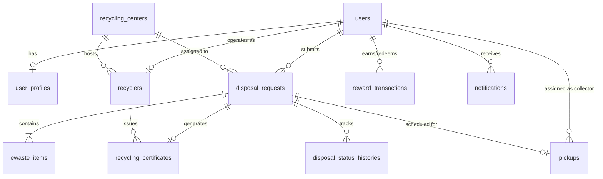

# Smart E-Waste Collection & Recycling Management System

A production-ready full-stack enterprise application for managing e-waste collection, doorstep pickup scheduling, verifiable public QR tracking, institutional bulk uploads, eco-credit rewards, and digital recycling certificates.

---

## 🏗 Architecture Overview

```
E-Waste-Management/
├── backend/                # Spring Boot REST API (Java 17+, Maven, JPA, Security, PostgreSQL/H2, Flyway)
│   ├── src/main/java/com/ewaste/management/
│   ├── src/main/resources/
│   │   └── db/migration/  # Flyway SQL schema & seed migrations
│   ├── pom.xml
│   ├── Dockerfile          # Multi-stage Java 17 production container build
│   └── mvnw / mvnw.cmd
├── frontend/               # React 18 + Vite Frontend (React Router, Axios, Bootstrap)
│   ├── src/
│   ├── package.json
│   ├── nginx.conf          # Production Nginx reverse proxy configuration
│   └── Dockerfile          # Multi-stage Node/Nginx container build
├── docker-compose.yml       # Multi-container orchestration (PostgreSQL, Backend, Frontend)
├── .env.example            # Environment configuration template
└── README.md
```

---

## 🗄️ Database & ER Schema Design

The application utilizes a relational database managed via Flyway versioned migrations (`V1__init_schema.sql` through `V11`).



---

## 📋 Prerequisites

Before starting, ensure you have the following installed on your machine:

- **Git**: [git-scm.com](https://git-scm.com/)
- **For Docker Deployment**:
  - **Docker Desktop** (Windows / macOS) or **Docker Engine & Docker Compose v2+** (Linux)
- **For Manual Local Development**:
  - **Java JDK**: Version 17 or higher (Java 17, 21, or 25 compatible)
  - **Node.js**: Version 18 or higher (includes `npm`)
  - **PostgreSQL** (Optional if using H2 in-memory mode for development)

---

## 🐳 Docker Deployment (Recommended)

Run the entire production stack (PostgreSQL + Spring Boot + React SPA) with a single command on any computer.

### 1. Clone & Configure Environment Variables
Copy the root `.env.example` file to create your local `.env`:

**Linux / macOS (Bash):**
```bash
cp .env.example .env
```

**Windows (PowerShell):**
```powershell
Copy-Item .env.example .env
```

**Windows (Command Prompt):**
```cmd
copy .env.example .env
```

### 2. Start Complete Stack
```bash
docker compose up --build
```

> **Note**: For older Docker installations, use `docker-compose up --build`.

### 3. Verification & Default Ports
- **Frontend SPA**: [http://localhost:5173](http://localhost:5173) (Served via Nginx on port 80 internally mapped to 5173)
- **Backend REST API**: [http://localhost:8080](http://localhost:8080)
- **API Health Check**: [http://localhost:8080/api/v1/health](http://localhost:8080/api/v1/health)
- **PostgreSQL Database**: `localhost:5432` (`ewastedb`)

To stop the Docker environment:
```bash
docker compose down
```

To stop and wipe persistent database volumes:
```bash
docker compose down -v
```

---

## ⚙️ Manual Local Development Setup

If you prefer running the services natively without Docker:

### 1. Database Setup
By default, the backend runs in `test` profile using an in-memory H2 database. To run with PostgreSQL:
1. Ensure PostgreSQL is running locally on port 5432.
2. Create database `ewastedb`:
   ```sql
   CREATE DATABASE ewastedb;
   CREATE USER ewaste_user WITH PASSWORD 'ewaste_password';
   GRANT ALL PRIVILEGES ON DATABASE ewastedb TO ewaste_user;
   ```

### 2. Backend Startup (Spring Boot)

Navigate to the `backend` directory:
```bash
cd backend
```

**Linux / macOS:**
```bash
./mvnw spring-boot:run
```

**Windows (PowerShell / CMD):**
```cmd
mvnw.cmd spring-boot:run
```

Execute backend automated unit tests:

**Linux / macOS:**
```bash
./mvnw test
```

**Windows:**
```cmd
mvnw.cmd test
```

### 3. Frontend Startup (React Vite)

Navigate to the `frontend` directory:
```bash
cd frontend
```

Install NPM packages:
```bash
npm install
```

Start Vite dev server:
```bash
npm run dev
```

Build production distribution:
```bash
npm run build
```

---

## 🔐 Environment Variables Reference

Key environment variables defined in `.env`:

| Variable | Description | Default / Fallback |
| :--- | :--- | :--- |
| `POSTGRES_DB` | Database Name | `ewastedb` |
| `POSTGRES_USER` | Database User | `ewaste_user` |
| `POSTGRES_PASSWORD` | Database Password | `ewaste_password_change_in_production` |
| `POSTGRES_PORT` | Database Port | `5432` |
| `SPRING_PROFILES_ACTIVE` | Active Spring Profile | `prod` (or `test` for H2) |
| `BACKEND_PORT` | Backend Host Port | `8080` |
| `FRONTEND_PORT` | Frontend Host Port | `5173` |
| `JWT_SECRET` | Secret signing key for JWT Bearer Tokens | `your_super_secret_jwt_key...` |

---

## 🛠️ Troubleshooting & Tips

### 1. Docker Port Conflicts
If port `8080`, `5173`, or `5432` is already in use on your host machine:
Edit `.env` and change the host port mappings (e.g., `BACKEND_PORT=8081`, `FRONTEND_PORT=3000`).

### 2. Database Healthcheck Delays
The backend container waits until PostgreSQL reports `service_healthy`. If the backend fails to start:
```bash
docker compose logs postgres
docker compose logs backend
```

### 3. Clearing Stale Containers & Volumes
If schema migrations fail or environment variables do not take effect:
```bash
docker compose down --volumes --remove-orphans
docker compose up --build
```
