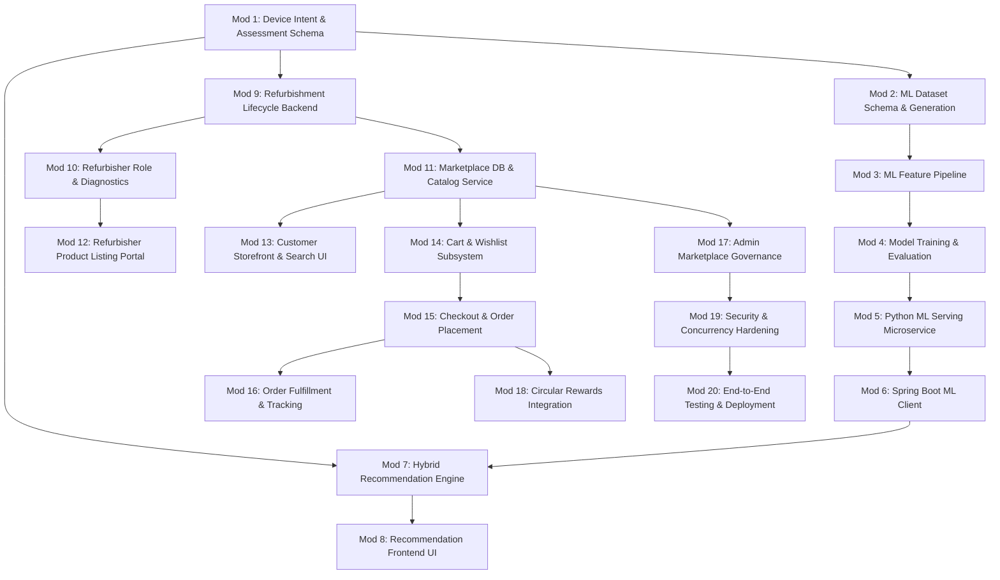

# AI-Powered Circular E-Waste Management & Refurbished Electronics Marketplace
## Architectural Blueprint & Comprehensive Phase-by-Phase Implementation Roadmap

---

### Executive Summary & Project Vision

The **Smart E-Waste Management System** is currently a production-ready, full-stack application facilitating responsible e-waste disposal, doorstep pickup logistics, environmental impact calculation, and statutory recycling certification across India.

This document defines the architectural blueprint and modular execution plan to expand the platform into an **AI-Powered Circular E-Waste & Refurbished Electronics Marketplace**. 

Instead of treating discarded electronic devices exclusively as scrap material, the extended system transforms the platform into a true **closed-loop circular economy engine**:
1. **Device Assessment & User Intention**: Capturing multi-dimensional hardware state alongside the user's personal intention for the device.
2. **Deterministic Safety Guardrails**: Hard rule-based safety screening to prevent hazardous or physically compromised devices from entering commercial reuse.
3. **Custom Machine Learning Model**: A dedicated Python-trained ML model (built with `scikit-learn`, `pandas`, and `joblib`) predicting the optimal circular destination (`KEEP_USING`, `REPAIR`, `REFURBISH`, `REFURBISH_AND_SELL`, `DONATE`, `RECYCLE`, `SPECIAL_HANDLING`).
4. **Refurbishment Technical Lifecycle**: A rigorous inspection, diagnostics, repair, quality check, and cosmetic grading pipeline ensuring no device directly enters commercial sale without verified technical certification.
5. **Integrated Refurbished Electronics Marketplace**: An integrated commercial hub inside the same unified platform where graded, warranted refurbished devices are sold in Indian Rupees (₹), complete with search, cart, wishlist, checkout, and order tracking.

---

## 1. Existing System Architecture Discovered

An exhaustive audit of the codebase yielded the following architectural baseline:

### 1.1 Backend Architecture
- **Framework**: Spring Boot 3.4.3 on Java 17, Maven-managed build.
- **Security**: Spring Security 6 with stateless JWT token authentication (`JwtAuthenticationFilter`), BCrypt password hashing, and role-based access control.
- **Persistence**: Spring Data JPA / Hibernate ORM connected to Supabase PostgreSQL (via pooling) with H2 database in test scope.
- **Database Migrations**: 11 Flyway SQL migrations (`V1` to `V11`) managing tables, constraints, initial seed data, and compliance guidelines.
- **Existing User Roles**: `USER`, `COLLECTOR`, `RECYCLER`, `ADMIN`.
- **Existing Recommendation Subsystem**:
  - Interface: `DisposalRecommendationEngine`
  - Implementation: `RuleBasedRecommendationEngine` evaluating `RecommendationInput` (category, age, condition, battery condition, damage condition) and returning `DisposalRecommendationResult`.
- **Existing Logistics & Certification**:
  - `DisposalRequest` and `EWasteItem`: Manages item submission, status progression (`SUBMITTED` $\rightarrow$ `COLLECTED` $\rightarrow$ `AT_RECYCLING_CENTER` $\rightarrow$ `RECYCLED` / `REFURBISHED` $\rightarrow$ `COMPLETED`).
  - `Pickup`: Doorstep collection assignment and status updates.
  - `RecyclingCertificate`: PDF generation with QR verification URLs.
  - `RewardTransaction`: Green points ledger for citizens and bulk institutions.
  - `EnvironmentalFactor`: Calculation of diverted landfill, CO₂ offset, recovered metals, and plastics.

### 1.2 Frontend Architecture
- **Framework**: React 18 with Vite 6.
- **Styling**: Bootstrap 5 + customized luxury editorial mineral design system in `frontend/src/index.css`.
- **Navigation & Routing**: React Router v6 with `ProtectedRoute` and `RoleProtectedRoute`.
- **API Client**: Axios configured with centralized `VITE_API_BASE_URL` and automatic JWT bearer token interceptors.
- **Dashboards**: Separate role-specific interfaces (`UserDashboard`, `CollectorDashboard`, `RecyclerDashboard`, `AdminDashboard`, `InstitutionDashboard`).

### 1.3 Production Deployment Baseline
- **Frontend**: Vercel SPA hosting (`vercel.json` rewrite configuration).
- **Backend**: Render Web Service (Docker deployment using Temurin-17 Alpine).
- **Database**: Supabase PostgreSQL with pooled connection string.

---

## 2. Component Reuse & Extension Analysis

To maintain architectural integrity, the new capabilities will **reuse and extend** existing components rather than create duplicate concepts:

| Existing Component | Current Role | Extension for Circular Marketplace |
|---|---|---|
| `User` & `UserProfile` | Citizen, Collector, Recycler, Admin accounts | Reused for Marketplace Buyers and Refurbishment Technicians. New role `REFURBISHER` added to `UserRole`. |
| `EWasteItem` | Single item in a disposal request | Extended with `user_intention`, `repairability_score`, `battery_health_percent`, `estimated_repair_cost`, and `estimated_resale_value`. |
| `DisposalRequest` | E-waste submission envelope | Extended with `recommendation_source` (`RULE_BASED`, `ML_MODEL`, `HYBRID`) and ML confidence metrics. |
| `DisposalAction` Enum | `REUSE`, `REPAIR`, `DONATE`, `REFURBISH`, `RECYCLE`, `SPECIAL_HANDLING` | Extended with `KEEP_USING` and `REFURBISH_AND_SELL`. |
| `DisposalRecommendationEngine` | Interface for rule-based recommendations | Reused as the core contract. A new `HybridRecommendationEngine` implements this interface, orchestrating safety rules and the custom ML model. |
| `DeviceCondition` Enum | `WORKING`, `PARTIALLY_WORKING`, `DAMAGED`, `NOT_WORKING`, `HAZARDOUS` | Reused as primary input feature for ML model and initial intake assessment. |
| `EWasteCategory` Enum | 15 electronics categories | Reused across ML feature vectors and Marketplace product categorization. |
| `RequestStatus` Enum | Request lifecycle tracker | Reused with existing `REFURBISHED` status integrated into the refurbishment tracking machine. |
| `RewardTransaction` | Green points ledger | Extended with `REFURBISHMENT_BONUS` reward points category. |
| `EnvironmentalFactor` | Carbon & landfill diversion analytics | Extended to credit higher environmental savings when devices are reused/refurbished vs shredded. |
| `NotificationService` | User alerts for pickups and certificates | Reused for marketplace order tracking and refurbishment inspection milestones. |

---

## 3. Custom Machine Learning Architecture

### 3.1 Core Philosophy: No Generic LLM Wrapper
The intelligence layer will **not** rely on external LLM APIs (OpenAI, Gemini, Claude) for core device classification. Instead, the platform will utilize a custom, offline-capable, supervised machine learning model trained on empirical device lifecycle metrics, degradation distributions, repair economics, and consumer intent.

### 3.2 Input Feature Vector (11 Features)
The model takes 11 structured attributes representing the physical, mechanical, operational, and financial condition of the device, alongside the user's intent:

1. **`device_category`** *(Categorical, 15 values)*: `MOBILE_PHONE`, `LAPTOP`, `DESKTOP`, `TABLET`, `MONITOR`, etc.
2. **`device_age_years`** *(Numerical, continuous: 0.1 to 15.0)*: Age calculated from release/purchase date.
3. **`working_condition`** *(Categorical, 5 values)*: `WORKING`, `PARTIALLY_WORKING`, `DAMAGED`, `NOT_WORKING`, `HAZARDOUS`.
4. **`physical_damage_level`** *(Categorical, 5 values)*: `NONE`, `MINOR_SCRATCHES`, `CRACKED_SCREEN`, `BROKEN_CHASSIS`, `WATER_EXPOSURE`.
5. **`battery_health_status`** *(Categorical, 5 values)*: `EXCELLENT`, `NORMAL`, `DEGRADED`, `DEAD`, `SWOLLEN_HAZARDOUS`.
6. **`functional_issues_count`** *(Numerical, integer: 0 to 8)*: Count of failed components (camera, keyboard, ports, Wi-Fi, speakers, display, power, sensors).
7. **`repairability_index`** *(Numerical, 1.0 to 10.0 scale)*: Standard hardware modularity score (ease of disassembly, parts availability).
8. **`estimated_repair_cost_ratio`** *(Numerical, continuous: 0.0 to 1.5)*: `Estimated Repair Cost / Current Market Value`.
9. **`estimated_resale_value_ratio`** *(Numerical, continuous: 0.0 to 1.0)*: `Estimated Resale Value / Original Purchase Price`.
10. **`is_hazardous_flag`** *(Binary, 0 or 1)*: Presence of exposed toxins, puncture, or thermal runaway risk.
11. **`user_intention`** *(Categorical, 7 values)*:
    - `KEEP_USING` ("I want to keep using it if possible")
    - `REPAIR` ("I want to repair it")
    - `REFURBISH` ("I want to refurbish it for personal/family reuse")
    - `REFURBISH_AND_SELL` ("I want to sell it after refurbishment on the marketplace")
    - `DONATE` ("I want to donate it to community/schools")
    - `RECYCLE` ("I want to responsibly recycle/dispose of it")
    - `UNSURE` ("I am not sure — recommend the best environmental & economic option")

### 3.3 Target Output Classes (7 Classes)
The model outputs probability distribution and prediction across 7 distinct operational decisions:
- **`KEEP_USING`**: Device is functionally sound or requires only minor software reset; owner should retain it.
- **`REPAIR`**: Minor hardware/battery replacement will return device to full personal utility.
- **`REFURBISH`**: Device requires comprehensive overhaul, component upgrades, and cosmetic restoration.
- **`REFURBISH_AND_SELL`**: Device has high commercial residual value and healthy secondary demand; optimal candidate for technical refurbishment and marketplace listing.
- **`DONATE`**: Functional device with low commercial resale value, ideal for educational non-profits or community digitization programs.
- **`RECYCLE`**: End-of-life device where material extraction and precious metal recovery yield the highest environmental benefit.
- **`SPECIAL_HANDLING`**: Hazardous or compromised electronics requiring specialized decontamination or isolated transit.

### 3.4 Dataset Strategy
A dedicated, reproducible dataset generation and curation pipeline will be created:
- **Ground Truth Foundation**: Modeled using established electronics depreciation curves, iFixit modular repairability metrics, and statutory Central Pollution Control Board (CPCB) guidelines.
- **Data Volume**: 8,000 to 12,000 synthetic and verified historical records with realistic non-linear correlations (e.g., severe physical damage or age > 7 years driving probability towards `RECYCLE`, high resale ratio + minor defect driving towards `REFURBISH_AND_SELL`).
- **Data Splitting**: Stratified 70% Training, 15% Validation, 15% Test set.
- **Artifacts**: Stored in `ml-service/data/` with schema verification.

### 3.5 ML Algorithms for Evaluation
1. **Random Forest Classifier**: Primary baseline; handles mixed feature types, captures non-linear feature interactions, and resists overfitting.
2. **Gradient Boosting (LightGBM / XGBoost)**: Optimized for tabular performance, high classification precision, and fast inference.
3. **Pipeline Serialization**: The best performing model will be serialized with its `ColumnTransformer` (OneHotEncoder + StandardScaler) using `joblib` into a production artifact: `model_pipeline.joblib`.

---

## 4. Safety Architecture & Hybrid Guardrail Engine

Machine learning models are probabilistic and can make edge-case errors. To protect safety and prevent hazardous items from entering reuse, the recommendation architecture uses a **3-Layer Hybrid Pipeline**:

```
                              [ User Device Submission ]
                                         │
                                         ▼
                 ┌─────────────────────────────────────────────────┐
                 │    Layer 1: Deterministic Safety Rule Engine    │
                 │         (Zero-Tolerance Safety Gate)            │
                 └───────────────────────┬─────────────────────────┘
                                         │
                   Is Hazardous / Swollen / Compromised?
                                         │
                       ┌─────────────────┴─────────────────┐
                      YES                                  NO
                       │                                   │
                       ▼                                   ▼
        ┌─────────────────────────────┐   ┌───────────────────────────────────┐
        │ Action: SPECIAL_HANDLING    │   │  Layer 2: Python ML Predictor     │
        │ - Bypass ML inference       │   │  (Trained Random Forest / GBDT)   │
        │ - Lock hazardous workflow   │   └─────────────────┬─────────────────┘
        │ - Generate safety transit   │                     │
        └─────────────────────────────┘                     ▼
                                          ┌───────────────────────────────────┐
                                          │ Layer 3: Policy & Business Filter │
                                          │ - Check intent feasibility        │
                                          │ - Fallback if ML offline          │
                                          └─────────────────┬─────────────────┘
                                                            │
                                                            ▼
                                          [ Final Validated Recommendation ]
```

1. **Layer 1 (Deterministic Safety Gate)**:
   - Evaluated in Java Spring Boot before invoking ML.
   - If `condition == HAZARDOUS` or battery condition includes `swollen`, `leak`, `bloated`, or `puncture`, the system immediately returns `SPECIAL_HANDLING`. **ML prediction is never permitted to override physical hazard rules.**
2. **Layer 2 (Custom ML Classification)**:
   - If safety checks pass, features are dispatched to the Python ML prediction service.
   - Returns predicted action, class confidence scores, and feature contribution weights.
3. **Layer 3 (Business & Fallback Policy)**:
   - Validates that user intention is aligned with the technical reality (e.g., if a user wants to `KEEP_USING` a completely dead laptop with water damage, the system explains why `RECYCLE` or `REPAIR` is necessary).
   - If the Python ML service is unreachable or encounters a timeout, the system gracefully degrades to the local `RuleBasedRecommendationEngine` with zero user disruption.

---

## 5. Refurbishment Lifecycle & Technical Governance

A user-submitted device **must never directly become a marketplace product**. It must follow a strict, auditable 7-stage chain of custody:

```
[Citizen Submission] 
       │ (Recommended for REFURBISH_AND_SELL)
       ▼
[Doorstep Collection] 
       │ (Assigned Collector picks up item)
       ▼
[Refurbisher Facility Intake] 
       │ (Technician verifies serial number and visual condition)
       ▼
[Technical Diagnostics] 
       │ (Hardware component testing: CPU, GPU, Display, Battery, Memory, Storage)
       ▼
[Refurbishment & Parts Replacement] 
       │ (Thermal repasting, part swapping, battery renewal, secure data sanitization)
       ▼
[Quality Control (QC) & Cosmetic Grading] 
       │ (Testing against 24-point checklist -> Awarded Grade A, B, or C)
       ▼
[Marketplace Product Generation]
       │ (Verified product listed in marketplace catalog for public purchase)
```

### Refurbishment Quality Grades:
- **Grade A (Pristine / Excellent)**: Zero screen scratches, flawless casing, battery health $\ge 85\%$, 100% functional, 6-month warranty.
- **Grade B (Very Good)**: Light micro-scratches on casing, zero screen cracks, battery health $\ge 75\%$, 100% functional, 3-month warranty.
- **Grade C (Good / Budget)**: Visible cosmetic wear/scuffs, screen fully intact, battery health $\ge 70\%$, 100% functional, 1-month warranty.

---

## 6. Refurbished Electronics Marketplace Architecture

The marketplace is an integrated module within the existing application, sharing authentication, layout, design tokens, and user state:

```
┌────────────────────────────────────────────────────────────────────────┐
│                          Unified Frontend                              │
│  ┌──────────────────────┐  ┌────────────────────┐  ┌────────────────┐  │
│  │ E-Waste Portal (Add) │  │ Technical Portal   │  │ Storefront     │  │
│  │ - Assessment         │  │ - Inspection       │  │ - Search/Filter│  │
│  │ - Intent Selection   │  │ - Grading & QC     │  │ - Cart/Wishlist│  │
│  │ - Status Tracking    │  │ - Product Publish  │  │ - Checkout/Pay │  │
│  └──────────────────────┘  └────────────────────┘  └────────────────┘  │
└────────────────────────────────────┬───────────────────────────────────┘
                                     │ REST APIs (JWT Bearer)
┌────────────────────────────────────▼───────────────────────────────────┐
│                     Spring Boot Backend Core (Port 8080)               │
│  ┌──────────────────┐  ┌──────────────────────┐  ┌──────────────────┐  │
│  │ Security & Auth  │  │ Refurbishment Engine │  │ Marketplace Core │  │
│  │ - Role Guards    │  │ - Lifecycle Tracker  │  │ - Catalog/Search │  │
│  │ - Preflight CORS │  │ - QC Checklist       │  │ - Cart/Order Svc │  │
│  └─────────┬────────┘  └──────────┬───────────┘  └─────────┬────────┘  │
│            │                      │                        │           │
│  ┌─────────▼──────────────────────▼────────────────────────▼────────┐  │
│  │ Hybrid Recommendation Service (Safety Rules + Fallback)         │  │
│  └────────────────────────────────┬─────────────────────────────────┘  │
└───────────────────────────────────┼────────────────────────────────────┘
                                    │ HTTP (Internal REST)
                                    ▼
┌────────────────────────────────────────────────────────────────────────┐
│                   Python ML Prediction Microservice (Port 5001)        │
│  - FastAPI REST API (`POST /api/v1/recommend`)                         │
│  - Scikit-Learn Pipeline (`model_pipeline.joblib`)                     │
│  - Automated Feature Validation with Pydantic                          │
└────────────────────────────────────────────────────────────────────────┘
```

---

## 7. Role Architecture: `RECYCLER` vs. `REFURBISHER`

### Determination:
A dedicated **`REFURBISHER`** role is **genuinely necessary** and architecturally superior to overloading the existing `RECYCLER` role:
1. **Statutory & Operational Divergence**: In India's e-waste regulatory framework (E-Waste Rules 2022), e-waste recyclers perform material dismantling, shredding, and chemical smelting. Refurbishers perform component recovery, software re-imaging, repair, and resale.
2. **Dashboard Separation**: Recyclers require scrap weight logging and destruction certificates. Refurbishers require diagnostic test sheets, parts inventory, grading checklists, and product listing tools.
3. **Security & Authorization**: Recyclers should not have authorization to list commercial products on the consumer marketplace, and refurbishers should not have permission to issue statutory destruction certificates.
4. **Implementation**:
   - `UserRole` enum extended with `REFURBISHER`.
   - Security permissions partitioned cleanly via `@PreAuthorize("hasRole('REFURBISHER') or hasRole('ADMIN')")`.

---

## 8. Database Extension Blueprint

The existing 11 Flyway migrations remain untouched. Future migrations will implement the following structured tables:

### 8.1 Migration: Device Assessment & Intention
- **`ewaste_items` (Table Alterations)**:
  - `user_intention` (`VARCHAR(40)`)
  - `physical_damage_level` (`VARCHAR(40)`)
  - `battery_health_status` (`VARCHAR(40)`)
  - `functional_issues` (`VARCHAR(500)`)
  - `repairability_index` (`NUMERIC(3, 1)`)
  - `estimated_repair_cost` (`NUMERIC(10, 2)`)
  - `estimated_resale_value` (`NUMERIC(10, 2)`)
- **`disposal_requests` (Table Alterations)**:
  - `recommendation_source` (`VARCHAR(30)` - `RULE_BASED`, `ML_MODEL`, `HYBRID`)
  - `ml_confidence_score` (`NUMERIC(5, 4)`)

### 8.2 Migration: Refurbishment Jobs & Technical Inspection
- **`refurbishment_jobs` (New Table)**:
  - `id` (`BIGSERIAL PRIMARY KEY`)
  - `job_number` (`VARCHAR(50) UNIQUE NOT NULL`)
  - `ewaste_item_id` (`BIGINT NOT NULL REFERENCES ewaste_items(id)`)
  - `refurbisher_id` (`BIGINT NOT NULL REFERENCES users(id)`)
  - `stage` (`VARCHAR(40) NOT NULL` - `RECEIVED`, `DIAGNOSTICS`, `REPAIRING`, `QC_TESTING`, `GRADED`, `COMPLETED`, `REJECTED_TO_RECYCLE`)
  - `cosmetic_grade` (`VARCHAR(20)` - `GRADE_A`, `GRADE_B`, `GRADE_C`)
  - `diagnostics_summary` (`TEXT`)
  - `parts_replaced` (`TEXT`)
  - `cost_of_refurbishment` (`NUMERIC(10, 2)`)
  - `qc_checklist_json` (`TEXT`)
  - `tested_at` (`TIMESTAMP`)
  - `created_at`, `updated_at` (`TIMESTAMP NOT NULL DEFAULT CURRENT_TIMESTAMP`)

### 8.3 Migration: Marketplace Catalog & Commerce
- **`marketplace_products` (New Table)**:
  - `id` (`BIGSERIAL PRIMARY KEY`)
  - `sku` (`VARCHAR(50) UNIQUE NOT NULL`)
  - `refurbishment_job_id` (`BIGINT UNIQUE REFERENCES refurbishment_jobs(id)`)
  - `seller_id` (`BIGINT NOT NULL REFERENCES users(id)`)
  - `title` (`VARCHAR(200) NOT NULL`)
  - `category` (`VARCHAR(50) NOT NULL`)
  - `brand` (`VARCHAR(100) NOT NULL`)
  - `model_name` (`VARCHAR(100) NOT NULL`)
  - `cosmetic_grade` (`VARCHAR(20) NOT NULL`)
  - `description` (`TEXT NOT NULL`)
  - `specifications_json` (`TEXT`)
  - `price_inr` (`NUMERIC(10, 2) NOT NULL`)
  - `original_mrp_inr` (`NUMERIC(10, 2)`)
  - `stock_quantity` (`INTEGER NOT NULL DEFAULT 1`)
  - `primary_image_url` (`VARCHAR(500) NOT NULL`)
  - `additional_images_json` (`TEXT`)
  - `warranty_period_months` (`INTEGER NOT NULL DEFAULT 3`)
  - `status` (`VARCHAR(30) NOT NULL DEFAULT 'AVAILABLE'` - `AVAILABLE`, `RESERVED`, `SOLD`, `DELISTED`)
  - `created_at`, `updated_at` (`TIMESTAMP NOT NULL DEFAULT CURRENT_TIMESTAMP`)

- **`marketplace_orders` & `marketplace_order_items` (New Tables)**:
  - Orders: `order_number`, `buyer_id`, `total_amount_inr`, `shipping_name`, `shipping_address`, `shipping_city`, `shipping_state`, `shipping_pincode`, `shipping_phone`, `order_status` (`PENDING`, `CONFIRMED`, `SHIPPED`, `DELIVERED`, `CANCELLED`), `tracking_number`, `created_at`, `updated_at`.
  - Items: `order_id`, `product_id`, `price_at_purchase`, `quantity`.

- **`cart_items` & `wishlist_items` (New Tables)**:
  - Associative tables linking `user_id` with `marketplace_products(id)` with timestamp and quantity.

---

## 9. Security, Concurrency & Fraud Prevention

The marketplace introduces commercial and transactional interactions requiring distinct security safeguards:
1. **Inventory Concurrency & Race Conditions**:
   - Refurbished products are typically unique or low-stock items (often quantity = 1).
   - Checkout must utilize database **Pessimistic Locking** (`SELECT ... FOR UPDATE` via `@Lock(LockModeType.PESSIMISTIC_WRITE)`) to prevent double-purchasing.
2. **Role & Resource Ownership Guarding**:
   - Only authorized `REFURBISHER` or `ADMIN` can create or modify `MarketplaceProduct` listings.
   - Refurbishers can only update products/jobs assigned to their facility.
   - Buyers can only access their own orders.
3. **Data Sanitization Certificate Requirement**:
   - Mandatory verification flag certifying that persistent storage media (SSD, HDD, Flash) has been sanitized according to NIST SP 800-88 standards before publishing any PC or mobile device to the marketplace.
4. **Input Sanitization & Pricing Integrity**:
   - Strict server-side validation on prices (non-negative, realistic bounds) and product descriptions (XSS prevention via escaping).
   - Order totals calculated strictly on the backend; client-submitted totals are ignored.

---

## 10. Phased Implementation Roadmap (20 Modules)

To ensure zero downtime, rigorous validation, and manageable pull requests, the implementation is partitioned into 20 clean, test-driven modules.



### Module 1: Device Intention & Extended Assessment Schema
- **Objective**: Extend device intake models and database schema with user intention and granular physical condition attributes.
- **Scope**:
  - Flyway migration adding `user_intention`, `damage_level`, `battery_health`, `repairability_index`, and financial estimates to `ewaste_items`.
  - Update `EWasteItem` entity, DTOs, and request validation.
  - Unit tests verifying backward compatibility with existing submissions.

### Module 2: ML Dataset Schema, Feature Specification & Ground Truth Generation
- **Objective**: Build a deterministic Python dataset generator synthesizing realistic, non-linear consumer electronics degradation scenarios.
- **Scope**:
  - Python data generation script in `ml-service/src/generate_dataset.py`.
  - Synthesis of 10,000 records across 15 categories, 5 conditions, and 7 intentions.
  - Distribution validation, statistical checks, and train/val/test splits.

### Module 3: ML Data Pipeline, Preprocessing & Feature Engineering
- **Objective**: Construct reproducible data transformation pipelines.
- **Scope**:
  - Scikit-Learn `ColumnTransformer` with `OneHotEncoder` and `RobustScaler`.
  - Feature encoding pipelines saved to pipeline definition scripts.
  - Unit tests for handling unknown categorical levels and missing values.

### Module 4: Custom Model Training, Cross-Validation & Hyperparameter Tuning
- **Objective**: Train and evaluate machine learning models for 7-class decision classification.
- **Scope**:
  - Training scripts comparing Random Forest and Gradient Boosting.
  - Cross-validation, confusion matrix generation, classification report, and feature importance analysis.
  - Export best-performing model pipeline to `ml-service/models/model_pipeline.joblib`.

### Module 5: Python ML Serving Microservice (FastAPI + Joblib)
- **Objective**: Create a fast, lightweight Python REST API serving inference.
- **Scope**:
  - FastAPI application with Pydantic request/response validation schemas.
  - Endpoint `POST /api/v1/recommend` returning predicted action, confidence score, and decision breakdown.
  - Healthcheck endpoint and containerization (`ml-service/Dockerfile`).

### Module 6: Spring Boot ML Client & Resilient Remote Integration
- **Objective**: Connect Spring Boot backend to the ML microservice with high reliability.
- **Scope**:
  - Spring `RestClient` with configurable timeouts and connection pooling.
  - Circuit-breaker/fallback pattern: if ML service times out (>2000ms) or is unreachable, failover immediately without blocking.
  - Integration tests with mocked ML responses.

### Module 7: Hybrid Recommendation Engine (Safety Guardrails + ML + Fallback)
- **Objective**: Unify deterministic safety rules, ML inference, and business logic into an authoritative recommendation service.
- **Scope**:
  - Implementation of `HybridRecommendationEngine` satisfying `DisposalRecommendationEngine`.
  - Strict enforcement: `HAZARDOUS` devices forced to `SPECIAL_HANDLING` before ML evaluation.
  - Detailed explanation generation translating ML probabilities into citizen-friendly guidance.
  - Full test suite verifying safety overrides and fallback behavior.

### Module 8: Frontend Device Assessment & Hybrid Recommendation UI
- **Objective**: Redesign the device submission wizard in React to capture user intent and display circular recommendations.
- **Scope**:
  - Update `AddEWaste.jsx` with intent selector cards and hardware condition toggles.
  - Rich recommendation result view showing action explanation, environmental benefit, and next step pathways (e.g. proceed to collection or view repair options).

### Module 9: Refurbishment Lifecycle Backend (RefurbishmentJob Entity & State Machine)
- **Objective**: Establish the technical chain-of-custody tracking for collected devices earmarked for refurbishment.
- **Scope**:
  - Flyway migration for `refurbishment_jobs`.
  - Entity `RefurbishmentJob`, repository, and stage transition state machine (`RECEIVED` $\rightarrow$ `DIAGNOSTICS` $\rightarrow$ `REPAIRING` $\rightarrow$ `QC_TESTING` $\rightarrow$ `GRADED` $\rightarrow$ `COMPLETED`).
  - Unit tests for lifecycle transitions.

### Module 10: Refurbisher Role, Authorization & Diagnostic Workflow
- **Objective**: Enable certified technical refurbishers to manage their diagnostic queue.
- **Scope**:
  - Add `REFURBISHER` to `UserRole` enum.
  - Backend API: `RefurbisherController` for logging diagnostic findings, parts replaced, and 24-point QC checklist.
  - Frontend: Dedicated `RefurbisherDashboard` for technician inspection workflow.

### Module 11: Marketplace Database Foundation & Product Catalog Services
- **Objective**: Build the core marketplace domain model, repositories, and read services.
- **Scope**:
  - Flyway migration for `marketplace_products`.
  - `MarketplaceProduct` entity with grade, pricing, warranty, and specifications.
  - `ProductCatalogService` with multi-facet filtering (category, grade, price range, brand) and pagination.

### Module 12: Marketplace Product Management & Refurbisher Listing Portal
- **Objective**: Allow refurbishers to convert approved `RefurbishmentJob` records into live marketplace listings.
- **Scope**:
  - Product creation and editing APIs with photo upload and NIST data wipe certification.
  - Refurbisher frontend portal for managing inventory, pricing, and stock status.

### Module 13: Marketplace Customer Storefront, Search, Filter & Product Detail UI
- **Objective**: Build the public-facing circular tech storefront.
- **Scope**:
  - Modern, responsive marketplace view (`/marketplace`) with luxury editorial styling.
  - Filter drawer (Brand, Price, Condition Grade, Category), keyword search, and sorting.
  - Comprehensive Product Detail Page (`/marketplace/product/:id`) displaying warranty details, refurbishment inspection report, and environmental savings.

### Module 14: Cart & Wishlist Subsystem (Backend & Frontend)
- **Objective**: Implement user shopping cart and saved wishlist.
- **Scope**:
  - Flyway migrations for `cart_items` and `wishlist_items`.
  - Cart and Wishlist REST controllers with badge counters.
  - Frontend floating cart drawer and dedicated Cart Page (`/cart`).

### Module 15: Checkout, Mock Payment Gateway & Order Placement
- **Objective**: Provide secure order placement and transaction handling in Indian Rupees (₹).
- **Scope**:
  - Database pessimistic locking on product stock to prevent duplicate orders.
  - Checkout API validating shipping addresses and payment confirmation.
  - Frontend Checkout Wizard (`/checkout`) with address entry and simulated UPI / Card payment.

### Module 16: Order Fulfillment, Tracking & Customer Order History
- **Objective**: Manage post-purchase order lifecycle and delivery tracking.
- **Scope**:
  - Order status machine (`CONFIRMED` $\rightarrow$ `PROCESSING` $\rightarrow$ `SHIPPED` $\rightarrow$ `DELIVERED`).
  - Buyer order history portal (`/user/orders`) and printable Refurbished Warranty Certificate.
  - Seller/Refurbisher shipping and tracking update portal.

### Module 17: Admin Marketplace Governance, Listing Approvals & Dispute Handling
- **Objective**: Equip system administrators with marketplace oversight tools.
- **Scope**:
  - Admin view for auditing product listings, delisting non-compliant items, and viewing transaction volume.
  - Platform-wide sales analytics and seller performance metrics.

### Module 18: Circular Rewards & Environmental Impact Integration for Refurbished Tech
- **Objective**: Close the loop between marketplace purchases, disposal rewards, and carbon analytics.
- **Scope**:
  - Issue citizen green points when their submitted device is successfully refurbished and sold.
  - Calculate extended product lifespan carbon credits in `AnalyticsService`.
  - Display lifetime electronic waste diverted through the marketplace on public impact dashboards.

### Module 19: Comprehensive Security, Rate Limiting & Concurrency Hardening
- **Objective**: Harden all new commercial endpoints against fraud and abuse.
- **Scope**:
  - Rate limiting on search and checkout endpoints.
  - OWASP Top 10 security audit: XSS prevention on user descriptions, CSRF protections, and strict authorization filters.
  - Comprehensive unit and integration test suite covering security edge cases.

### Module 20: End-to-End Integration Testing, Containerization & Production Deployment Strategy
- **Objective**: Finalize multi-service packaging and production release readiness.
- **Scope**:
  - End-to-end Cypress/Playwright or Spring MockMvc integration tests simulating full user device submission $\rightarrow$ refurbishment $\rightarrow$ marketplace sale flow.
  - Multi-stage Docker packaging for both Spring Boot and Python ML services.
  - Deployment configuration documentation for Render (Backend + ML microservice) and Vercel (Frontend).

---

## 11. Module Dependency Matrix

```
┌─────────────────────────────────────────────────────────────┐
│                       Module Dependencies                   │
├─────────┬───────────────────────────────────────────────────┤
│ Module  │ Required Prerequisites                            │
├─────────┼───────────────────────────────────────────────────┤
│ Mod 1   │ Existing baseline (None)                          │
│ Mod 2   │ Mod 1 (Feature schema established)                │
│ Mod 3   │ Mod 2 (Dataset synthesized)                       │
│ Mod 4   │ Mod 3 (Preprocessing pipeline built)              │
│ Mod 5   │ Mod 4 (Model serialized)                          │
│ Mod 6   │ Mod 5 (ML microservice running)                   │
│ Mod 7   │ Mod 1, Mod 6 (Entities + ML Client ready)         │
│ Mod 8   │ Mod 7 (Recommendation API ready)                  │
│ Mod 9   │ Mod 1 (Item schema extended)                      │
│ Mod 10  │ Mod 9 (Refurbishment jobs schema ready)           │
│ Mod 11  │ Mod 9 (Refurbishment lifecycle ready)             │
│ Mod 12  │ Mod 10, Mod 11 (Catalog service + Refurbisher)    │
│ Mod 13  │ Mod 11 (Product catalog API ready)                │
│ Mod 14  │ Mod 11 (Product entities ready)                   │
│ Mod 15  │ Mod 14 (Cart subsystem ready)                     │
│ Mod 16  │ Mod 15 (Order placement ready)                    │
│ Mod 17  │ Mod 11, Mod 15 (Catalog + Orders ready)           │
│ Mod 18  │ Mod 15 (Orders + Analytics engine ready)          │
│ Mod 19  │ Mod 1 to Mod 18 (All features implemented)        │
│ Mod 20  │ Mod 19 (Security hardened, ready for release)     │
└─────────┴───────────────────────────────────────────────────┘
```

---

## 12. Risks, Edge Cases & Mitigation Strategies

1. **Cold Start & Latency in Python Microservice**:
   - *Risk*: A remote Python service on free/cheap hosting might experience latency or cold start delays.
   - *Mitigation*: The `HybridRecommendationEngine` enforces an aggressive 2.0-second timeout. If the ML service does not reply within 2 seconds, it instantly returns the deterministic rule-based recommendation without failing the user's submission.
2. **Double-Selling Unique Refurbished Units**:
   - *Risk*: Refurbished products are typically 1-of-1 inventory. Two concurrent buyers checking out the same device could create conflicting orders.
   - *Mitigation*: Implementation of database-level pessimistic locking during stock deduction inside an isolated `@Transactional` boundary.
3. **Hazardous Battery Infiltration**:
   - *Risk*: A user marks a bloated battery as "Partially Working" to get a higher reward.
   - *Mitigation*: Technician intake diagnostics require mandatory verification of physical battery integrity before the device can move to the refurbishment stage. Any discovered hazard immediately flips the job to `REJECTED_TO_RECYCLE`.
4. **Data Privacy on Secondary Devices**:
   - *Risk*: Personal data lingering on refurbished phones or laptops sold to new buyers.
   - *Mitigation*: A mandatory cryptographic / factory wipe checklist must be submitted and signed off by the certified refurbisher before the marketplace publication button is unlocked.
